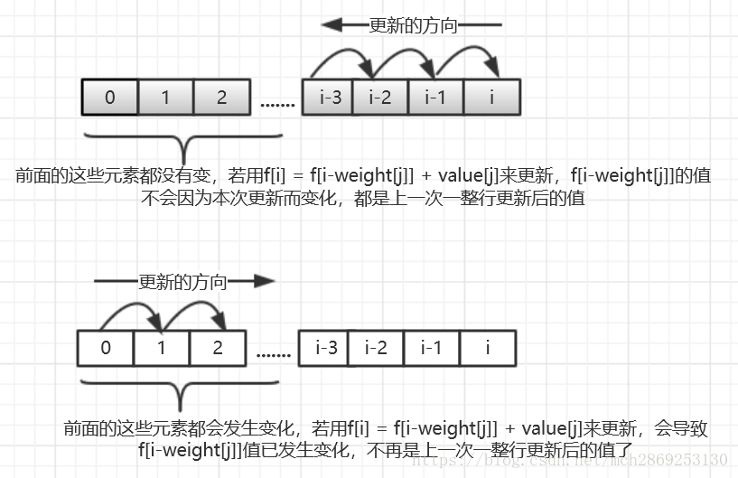

# Knapsack Problem 背包问题
## 0-1 Knapsack Problem 0-1背包问题
问题: 给定n个物品，每个物品的重量为w[i], 价值为v[i], 对于一个给定的重量上限W, 求能装下的物品的最大价值总和(**每个物品的数量为0 or 1**)

### solution
直接搜索的话按照选或者不选的方式进行search时间复杂度是O(2^n)  
将问题分解为子问题: **取前i个物品组成重量j的最大价值**, 记为dp[i][j]
对于第i件物品, 有两种情况:
* 不选: dp[i][j] = dp[i - 1][j]
* 选: dp[i][j] = v[i] + dp[i - 1][j - w[i]]
可以得到状态转移方程:
```py
for i = 1 to N:
    for j = 0 to W:
        dp[i][j] = max(dp[i - 1][j], 
                       v[i] + dp[i - 1][j - w[i]])
```
time complexity: O(mn)
space: O(mn)

#### dp数组降维
遍历j的时候需要**倒序**,防止dp overwrite
dp[i][w]是由dp[i-1][w]和dp[i-1][w-v[i]]递推而来，  
现在我们只用一个dp[0... W]数组来进行递推，为了保证dp[w - v[i]]的值(在数组前面部分)不会在递推时候更新(保证了每个物品最多选取1次,保证使用的是dp[i-1]的值)，所以需要倒序推dp[j]



倒序更新一维数组才不会出现dp overwrite
```py
def Knapsack01(w, v):
    dp = new int[W + 1]
    for i = 1 to N:
        for j = W to w[i]:
            dp[j] = max(dp[j], dp[j - w[i]] + v[i])

    return max(dp)
```
*space complexity: O(Weight)*

## Unbounded Knapsack Problem 完全背包问题
问题：有N种物品和一个容量为W的背包，每种物品都有**无限件**可用。第i种物品的重量是w[i]，价值是v[i]。求解将哪些物品装入背包可使这些物品的费用总和不超过背包容量，且价值总和最大。

思路: 转化为0-1背包问题, 每一个item最多出现[W/w[i]]次:

```py
for i = 1 to N:
    for j = 1 to W/w[i]:
        # knapsack01(w[i], v[i])
        dp[i][j]=max{f[i-1][j-k*w[i]]+k*v[i]|0<=k*w[i]<=W}
```
time: O(∑(W/w[i])*W) = O(NW^2)

**优化: O(WN)算法**
在0-1背包问题中，j的遍历顺序是W -> w[i], 目的是为了每个物品最多使用一次，递推的时候不会更新dp数组(使用了dp[i - 1]的值). 在完全背包问题中, dp的状态转移方程:
```py
dp[i][j] = max(dp[i - 1][j], 
                       v[i] + dp[i][j - w[i]])
```
所以在一维数组的情况下，我们需要更新之前的dp数组，需要一个可能已选入第i种物品的子结果dp[i][j-w[i]]，所以就可以并且必须采用j的**顺序**循环:

对于一维dp数组dp[0...N]:
```py
for i = 1 to N:
    for j = w[i] to W:
        dp[j] = max(dp[j], dp[j - w[i]] + v[i])

return dp[W]
```
**结论(数学归纳法待证明): 如果dp初始化成0, 从小到大枚举一定可以枚举到最优解(dp[j - w[i]]包含了之前的状态)**

## Bounded Knapsack Problem 多重背包问题
问题: 有N种物品和一个容量为W的背包。第i种物品最多有n[i]件可用，每件重量是w[i]，价值是v[i]。求解将哪些物品装入背包可使这些物品的费用总和不超过背包容量，且价值总和最大。

状态转移方程:
```py
for i = 1 to N:
    for j = 1 to n[i]:
    # knapsack01(w[i], v[i])
    dp[i][j]=max{f[i-1][j-k*w[i]]+k*v[i]|0<=k<=n[i]}
```
time: O(V*∑n[i])

转化为一维数组:
dp[0...W], 转化为0-1背包问题时加一层遍历(数据规模小), 对于每一层0-1背包进行**倒序**遍历
```cpp
for (int i = 0; i < N; ++i) 
    for (int j = W; j >= w[i]; --j)
        for (int k = 1; k <= n[i] && k * w[i] <= j; ++k) 
            dp[j] = max(dp[j], dp[j - k*w[i]] + k * v[i]);

return dp[W];
```

二进制优化(待补充)
