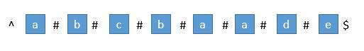
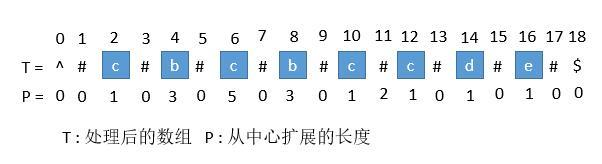
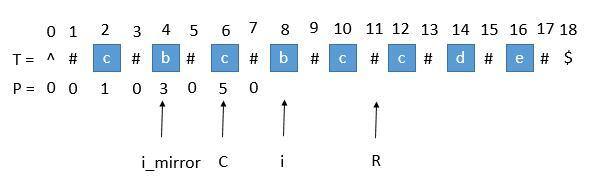
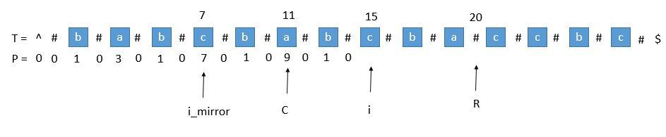
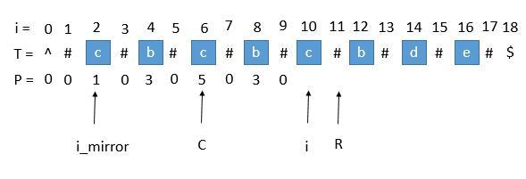

# Manacher's Algorithm
Example Question: [leetcode 5.Longest Palindromic Substring](https://leetcode.com/problems/longest-palindromic-substring/)

### 思路  
维护一个跟原串 str 一样长的数组 lens。lens[i] 表示以 str[i] 为中点的回串其中一边的长度(不包括中心点)
### 算法([Reference Link](https://leetcode.wang/leetCode-5-Longest-Palindromic-Substring.html))  
#### 重建字符串为奇数长度字符串
在每个字符间插入"#"，并且为了使得扩展的过程中，到边界后自动结束，在两端分别插入 "^" 和 "$"，两个不可能在字符串中出现的字符，这样中心扩展的时候，判断两端字符是否相等的时候，如果到了边界就一定会不相等，从而出了循环。经过处理，字符串的长度永远都是奇数了。
  
首先我们用一个数组 P 保存从中心扩展的最大个数，而它刚好也是去掉 "#" 的原字符串的总长度。例如下图中下标是 6 的地方。可以看到 P[ 6 ] 等于 5，所以它是从左边扩展 5 个字符，相应的右边也是扩展 5 个字符，也就是 "#c#b#c#b#c#"。而去掉 # 恢复到原来的字符串，变成 "cbcbc"，它的长度刚好也就是 5。
  

#### 对应原字符串下标
用 P 的下标 i 减去 P[i]，再除以 2 ，就是原字符串的开头下标了。例如我们找到 P[i] 的最大值为 5 , 也就是回文串的最大长度是 5 ，对应的下标是 6 ，所以原字符串的开头下标是 （6 - 5 ）/ 2 = 0 。所以我们只需要返回原字符串的**第 0 到 第 （5 - 1）位**就可以了。

#### 求P[i]
我们用 C 表示回文串的中心，用 R 表示回文串的右边半径坐标，所以 R = C + P[C] 。C 和 R 所对应的回文串是当前循环中 R 最靠右的回文串。  
让我们考虑求 P [i] 的时候，用 i_mirror 表示当前需要求的第 i 个字符关于 C 对应的下标。
  
我们现在要求 P [i]， 如果是用中心扩展法，那就向两边扩展比对就行了。但是我们其实可以利用回文串 C 的对称性。i 关于 C 的对称点是 i_mirror ，P [i_mirror] = 3，所以 P [i] 也等于 3 。  
但是有三种情况将会造成直接赋值为 P [ i_mirror ] 是不正确的，下边一一讨论。

- 超出了 R
    
  当我们要求 P [ i ] 的时候，P [ mirror ] = 7，而此时 P [ i ] 并不等于 7 ，为什么呢，因为我们从 i 开始往后数 7 个，等于 22 ，已经超过了最右的 R ，此时不能利用对称性了，但我们一定可以扩展到 R 的，所以 P [ i ] 至少等于 R - i = 20 - 15 = 5，会不会更大呢，我们只需要比较 T [ R+1 ] 和 T [ R+1 ]关于 i 的对称点就行了，就像中心扩展法一样一个个扩展。
- P [ i_mirror ] 遇到了原字符串的左边界
    
  此时P [ i_mirror ] = 1，但是 P [ i ] 赋值成 1 是不正确的，出现这种情况的原因是 P [ i_mirror ] 在扩展的时候首先是 "#" == "#" ，之后遇到了 "^"和另一个字符比较，也就是到了边界，才终止循环的。而 P [ i ] 并没有遇到边界，所以我们可以继续通过中心扩展法一步一步向两边扩展就行了。
- i = R
  此时我们先把 P [ i ] 赋值为 0 ，然后通过中心扩展法一步一步扩展就行了。

#### C 和 R 的更新
就这样一步一步的求出每个 P [ i ]，当求出的 P [ i ] 的右边界大于当前的 R 时，我们就需要更新 C 和 R 为当前的回文串了。因为我们必须保证 i 在 R 里面，所以一旦有更右边的 R 就要更新 R。  
  
此时的 P [ i ] 求出来将会是 3 ，P [ i ] 对应的右边界将是 10 + 3 = 13，所以大于当前的 R ，我们需要把 C 更新成 i 的值，也就是 10 ，R 更新成 13。继续下边的循环。

### **Solution**
C++:
```cpp
class Solution {
public:
    string longestPalindrome(string s) {
        if (s.size() < 2) return s;
        string p = "^";
        for (auto c : s) {
            p += "#";
            p += c;
        }
        p += "#$";
        vector<int> dp(p.size(), 0);
        int center = 0, r = 0;  // r: center对应最长回文右边界
        for (int i = 1; i < p.size() - 1; ++i) {
            int i_m = 2 * center - i;
            dp[i] = r >= i ? min(r - i, dp[i_m]) : 0;
            while (p[i + dp[i] + 1] == p[i - dp[i] - 1]) { dp[i]++; }
            if (i + dp[i] > r) {
                center = i;
                r = i + dp[i];
            }
        }
        center = max_element(dp.begin(), dp.end()) - dp.begin();
        return s.substr((center - dp[center]) / 2, dp[center]);
    }
};
```
### Complexity
时间复杂度：O(n)。我们想象一下整个过程，首先外层有一个 for 循环，所以每个字符会遍历一次，而当我们扩展的时候，每次都是从 R + 1 开始扩展，之后又会更新 R 。所以一些字符会遍历两次，但此时这些字符变到 R 的左边(i -> r的部分预设在了dp[i]里，不会再遍历)，所以不会遍历第三次了，因为我们每次从 R 的右边开始扩展。综上，每个字符其实最多遍历 2 次，所以依旧是线性的。当然如果字符串长度是 len ，由于扩展了字符串，这里的 n 其实是 2 * len + 3 ，所以是O（2 * len + 3），就是 O（len）。  
空间复杂度: O(n)。
